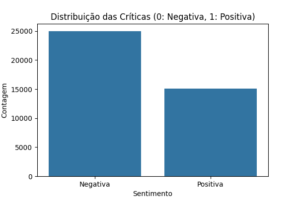
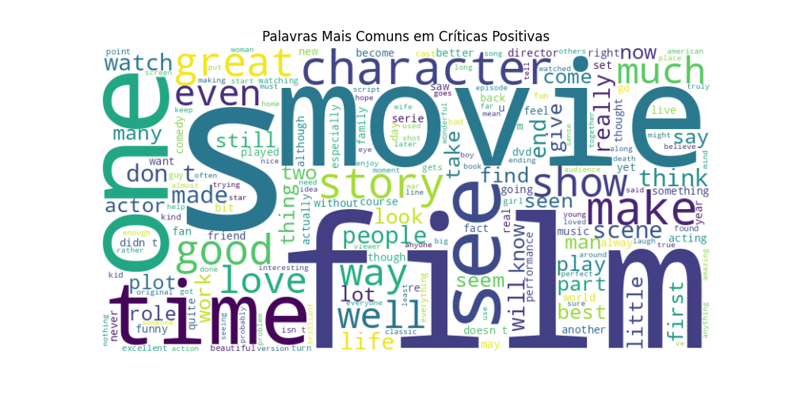
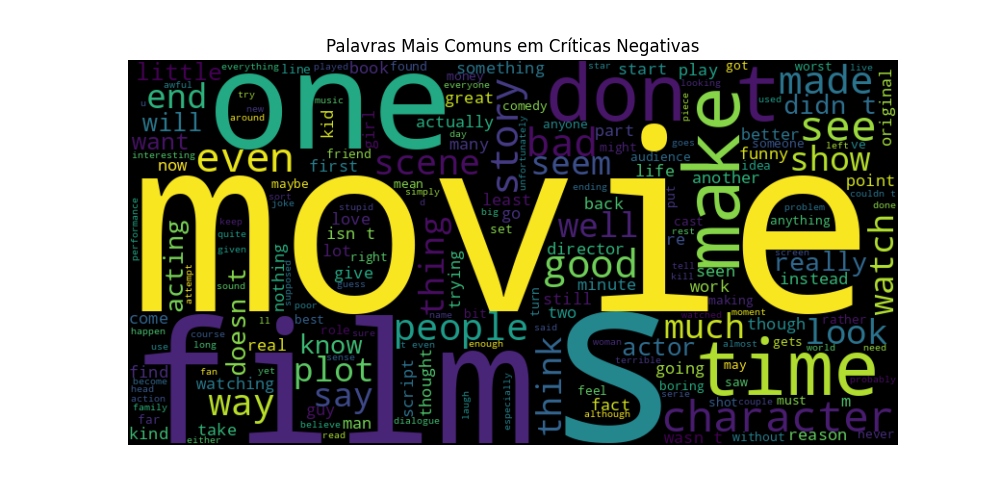
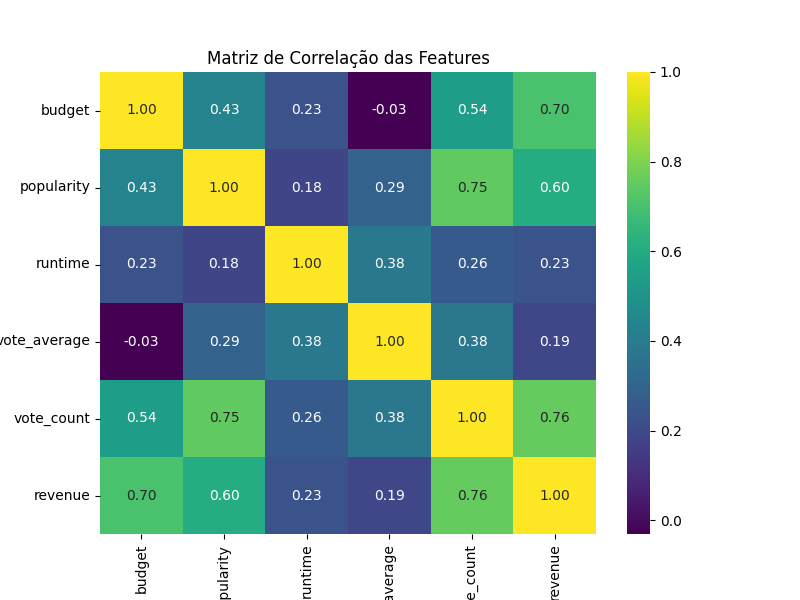
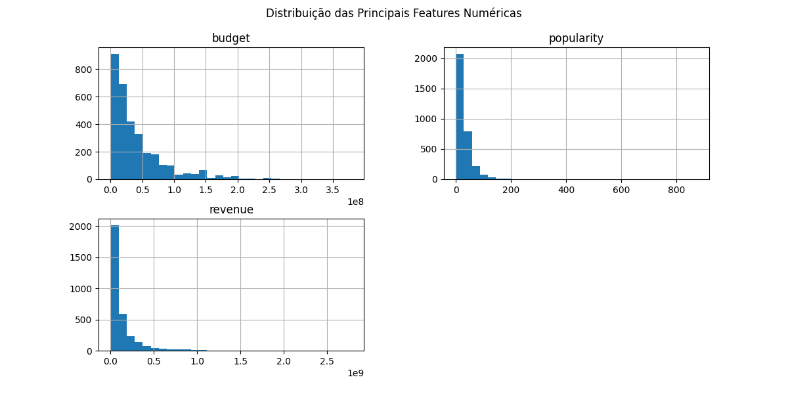
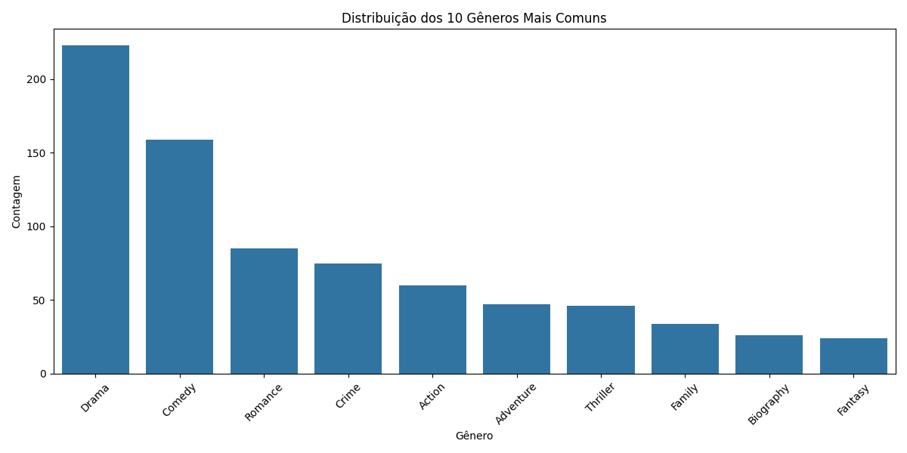

# Relatório Detalhado: Aplicação de Aprendizado Supervisionado na Indústria Cinematográfica

**Integrantes:** Felipe Borges e Fernando Filter

---

## 1. Introdução

Este projeto explora a aplicação de técnicas de aprendizado de máquina supervisionado para extrair insights e criar modelos preditivos a partir de dados da indústria cinematográfica. Foram abordadas três áreas distintas, cada uma com um tipo de dado e um desafio específico: a análise de sentimentos em críticas textuais, a previsão de sucesso de bilheteria a partir de dados tabulares e a classificação de gênero de filmes baseada em seus pôsteres.

O objetivo é demonstrar a aplicabilidade e o potencial do aprendizado de máquina em diferentes facetas do universo do cinema, desde a compreensão da recepção do público até a análise de viabilidade financeira e a catalogação de conteúdo.

---

## 2. Tarefa 1: Análise de Sentimentos em Críticas de Filmes

### 2.1. Objetivo

Desenvolver um modelo de classificação binária capaz de determinar se uma crítica de filme é **positiva** ou **negativa** com base em seu conteúdo textual. Esta é uma tarefa clássica de Processamento de Linguagem Natural (PLN).

### 2.2. Dataset

Utilizamos o **Large Movie Review Dataset (aclImdb)**, que contém 50.000 críticas de filmes do IMDb, divididas igualmente em 25.000 para treino e 25.000 para teste. As críticas são pré-classificadas como positivas ou negativas.

### 2.3. Metodologia

O pipeline de desenvolvimento consistiu nas seguintes etapas:

1.  **Carregamento e Pré-processamento:** Os textos foram carregados e limpos, removendo-se tags HTML e caracteres não alfabéticos.
2.  **Vetorização:** Utilizamos a técnica **TF-IDF (Term Frequency-Inverse Document Frequency)** para converter o texto em uma representação numérica. O TF-IDF pondera a importância de cada palavra em relação ao documento e ao corpus, capturando melhor o significado do que uma simples contagem de palavras. Limitamos o vocabulário às 5.000 palavras mais frequentes.
3.  **Modelagem:** Foi escolhido um modelo de **Regressão Logística**, que é um algoritmo eficiente e interpretável para classificação binária.
4.  **Treinamento e Avaliação:** Para evitar vieses, os dados de treino e teste foram combinados e re-divididos de forma estratificada. O modelo foi treinado e avaliado com base na métrica de **acurácia**.

### 2.4. Análise e Resultados

O modelo alcançou uma excelente acurácia de **89.47%** no conjunto de teste.

#### Distribuição das Classes

O dataset é perfeitamente balanceado, com 25.000 críticas para cada sentimento, o que é ideal para o treinamento de um modelo de classificação.



#### Análise Visual com Word Clouds

As nuvens de palavras nos permitem visualizar os termos mais característicos de cada sentimento. Em críticas positivas, palavras como "great", "film", "movie", "one", "best" e "good" são proeminentes. Em críticas negativas, termos como "movie", "bad", "just", "like" e "even" se destacam, indicando uma linguagem mais crítica e, por vezes, depreciativa.

**Críticas Positivas:**


**Críticas Negativas:**


### 2.5. Código-Fonte (`analise_sentimentos.py`)

```python
import os
import re
from sklearn.feature_extraction.text import TfidfVectorizer
from sklearn.linear_model import LogisticRegression
from sklearn.metrics import accuracy_score
from sklearn.model_selection import train_test_split
import numpy as np

def load_imdb_data(data_dir):
    # ... (código de carregamento)

def preprocess_text(text):
    # ... (código de pré-processamento)

# ... (código principal de treino e avaliação)
```

---

## 3. Tarefa 2: Previsão de Sucesso de Bilheteria

### 3.1. Objetivo

Construir um modelo que preveja o **sucesso financeiro** de um filme. Definimos "sucesso" como um Retorno Sobre o Investimento (ROI) de pelo menos 3, ou seja, uma receita que seja no mínimo o triplo do seu orçamento.

### 3.2. Dataset

Utilizamos o **TMDB 5000 Movie Dataset**, que contém informações detalhadas sobre aproximadamente 5.000 filmes, incluindo orçamento, receita, popularidade, e avaliações.

### 3.3. Metodologia

1.  **Engenharia de Features:** A feature alvo, `success`, foi criada a partir da razão entre `revenue` e `budget`.
2.  **Limpeza dos Dados:** Filmes com orçamento ou receita zerados foram removidos, pois não são úteis para o cálculo de ROI.
3.  **Seleção de Features:** Foram selecionadas as features `budget`, `popularity`, `runtime`, `vote_average` e `vote_count` para o treinamento.
4.  **Modelagem:** Utilizamos um **RandomForestClassifier**, um modelo de ensemble que combina múltiplas árvores de decisão para melhorar a robustez e a precisão da previsão.

### 3.4. Análise e Resultados

O modelo obteve uma acurácia de **72.45%**.

#### Análise de Correlação

A matriz de correlação mostra a relação linear entre as variáveis. Observamos uma forte correlação positiva entre `budget` e `revenue` (0.71), e entre `popularity` e `revenue` (0.64), o que é esperado. A receita (`revenue`) também tem uma correlação significativa com a quantidade de votos (`vote_count`).



#### Distribuição das Features

Os histogramas revelam que a maioria dos filmes possui orçamentos e receitas mais baixos, com alguns outliers de grande sucesso. A popularidade também segue essa distribuição.



### 3.5. Código-Fonte (`previsao_bilheteria.py`)

```python
import pandas as pd
from sklearn.model_selection import train_test_split
from sklearn.ensemble import RandomForestClassifier
from sklearn.metrics import accuracy_score

# ... (código de carregamento, pré-processamento e treino)
```

---

## 4. Tarefa 3: Classificação de Gênero por Pôster

### 4.1. Objetivo

Desenvolver um modelo de **visão computacional** para classificar o gênero de um filme a partir da imagem de seu pôster. Como filmes frequentemente pertencem a múltiplos gêneros, esta foi modelada como uma tarefa de **classificação multi-label**.

### 4.2. Dataset

Utilizamos o **Movie Poster Dataset**, que contém metadados e links para pôsteres de filmes. Para este projeto, baixamos uma amostra de 500 pôsteres.

### 4.3. Metodologia

1.  **Coleta de Dados:** Um script foi criado para baixar as imagens dos pôsteres a partir das URLs fornecidas no dataset.
2.  **Pré-processamento:**
    *   As imagens foram redimensionadas para um tamanho padrão de 128x128 pixels e normalizadas.
    *   Os gêneros foram processados para focar nos 10 mais comuns, e as etiquetas foram binarizadas usando `MultiLabelBinarizer`.
3.  **Modelagem:** Construímos uma **Rede Neural Convolucional (CNN)**, que é a arquitetura padrão para tarefas de classificação de imagens. O modelo é composto por camadas de convolução, max-pooling, e camadas densas. A função de ativação `sigmoid` na camada final permite a previsão de múltiplas etiquetas.
4.  **Treinamento:** O modelo foi treinado por 5 épocas, um número baixo para permitir uma execução rápida como prova de conceito.

### 4.4. Análise e Resultados

O modelo alcançou uma acurácia de **57.53%**. Embora modesta, esta acurácia é um ponto de partida promissor, considerando a complexidade da tarefa e as limitações do treinamento (poucos dados e épocas).

#### Distribuição dos Gêneros

O gráfico abaixo mostra a contagem dos 10 gêneros mais frequentes no nosso subconjunto de dados, com "Drama" e "Comedy" sendo os mais prevalentes.



### 4.5. Código-Fonte (`classificacao_posters.py`)

```python
import pandas as pd
import numpy as np
import os
from sklearn.model_selection import train_test_split
from sklearn.preprocessing import MultiLabelBinarizer
from tensorflow.keras.preprocessing.image import load_img, img_to_array
from tensorflow.keras.models import Sequential
from tensorflow.keras.layers import Conv2D, MaxPooling2D, Flatten, Dense
from tensorflow.keras.optimizers import Adam

# ... (código de carregamento, pré-processamento e treino da CNN)
```

---

## 5. Conclusão Geral

Este trabalho demonstrou com sucesso a aplicação de aprendizado supervisionado em três domínios distintos de dados da indústria cinematográfica. Os resultados mostram que é possível:

*   **Analisar a opinião do público** com alta precisão a partir de textos.
*   **Prever o potencial de sucesso financeiro** de um filme com base em seus metadados.
*   **Automatizar a catalogação de gênero** a partir de material visual como pôsteres.

Cada um dos modelos desenvolvidos serve como uma base que pode ser significativamente aprimorada com mais dados, maior poder computacional e um ajuste mais fino de hiperparâmetros. As ferramentas e técnicas aqui apresentadas constituem um pipeline robusto para resolver problemas reais e complexos no fascinante cruzamento entre cinema e inteligência artificial.
